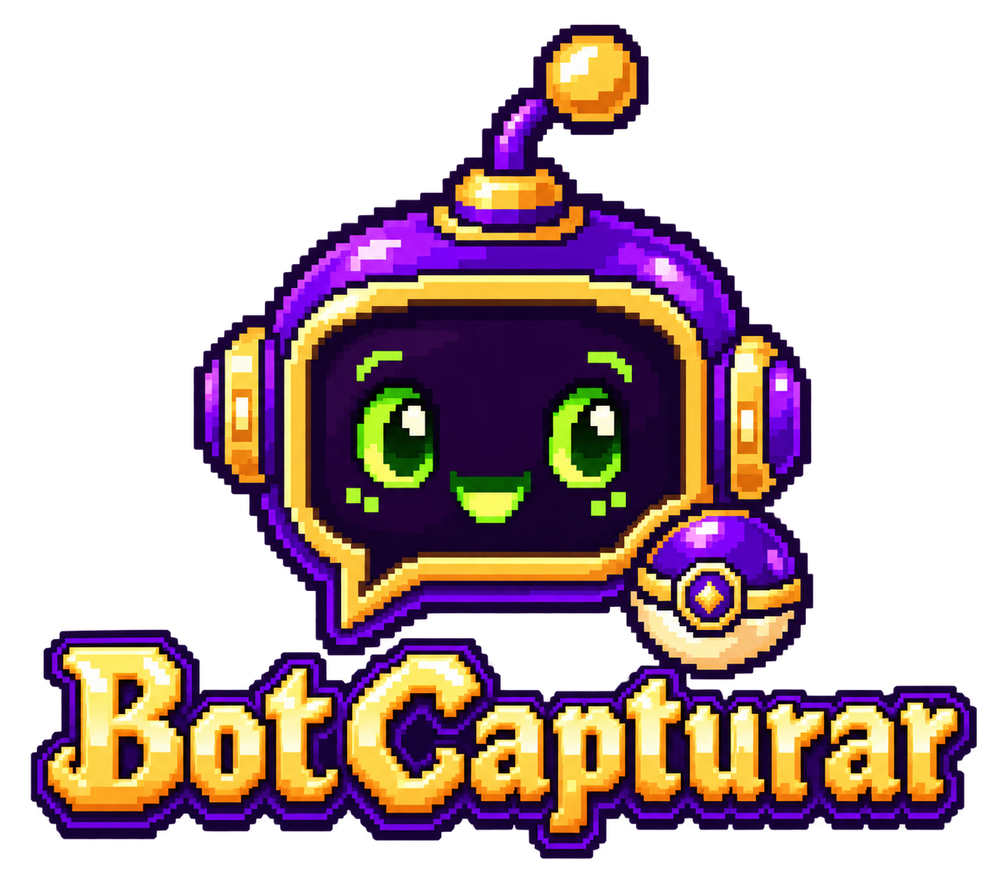

# BotCapturar

Aplicativo desktop com identidade pixel-art do Capturix para enviar o comando `$capturar` no chat de uma live da Kick. Ao clicar em **Iniciar**, a primeira mensagem é enviada imediatamente; depois o BotCapturar envia outra a cada **5 minutos e 5 segundos**. **Parar** cancela os próximos envios.

O aplicativo usa a API oficial da Kick. O navegador abre somente durante a autorização OAuth; não precisa ficar aberto enquanto as mensagens são enviadas.

## Antes de começar

- Windows 10/11 x64.
- Acesso à conta Kick autorizada a escrever no chat do canal.
- Uma Kick App criada por você na área de desenvolvedor da Kick.

## Criar sua Kick App

1. Entre na conta Kick que será usada para enviar a mensagem e ative a autenticação de dois fatores (2FA).
2. Abra as configurações da Kick, entre em **Developer** e escolha criar uma aplicação.
3. Dê um nome à app, por exemplo `BotCapturar`, e escreva uma descrição.
4. No campo **Redirect URL**, informe exatamente:

   ```text
   http://localhost:8765/callback
   ```

   Use `http`, não `https`; o endereço, a porta `8765` e o caminho `/callback` precisam corresponder exatamente.

5. Deixe **Webhooks** desativado.
6. Em permissões, habilite **Escrever no feed do Chat** (`chat:write`). Não habilite permissões de moderação, chave de transmissão, anúncios ou recompensas para esta automação. Se a Kick deixar uma permissão básica de leitura já marcada e bloqueada, mantenha o padrão; o BotCapturar solicita `chat:write` para enviar.
7. Crie a app e copie o **Client ID** e o **Client Secret**.

### Qual é qual?

- **Client ID:** identifica sua Kick App. Cole no campo **Kick App Client ID** do BotCapturar.
- **Client Secret:** chave privada da sua Kick App, parecida com uma senha. Cole no campo **Kick App Client Secret**. Não a envie para outras pessoas nem para o desenvolvedor do BotCapturar.
- **`chat:write`:** permissão solicitada na Kick para a conta autorizada poder enviar mensagens no chat. Não é uma chave que você precisa copiar.
- **Redirect URL:** endereço local para o qual a Kick retorna depois que você aprova o acesso. Ele não é um site para hospedar.

Cada usuário deve criar e usar a própria Kick App. O Client Secret e os tokens OAuth são gravados no Gerenciador de Credenciais do Windows daquele usuário e não são incluídos no executável ou instalador.

## Configurar e usar — sequência de botões

1. Abra o BotCapturar. No campo **Nome do canal na Kick (slug)**, digite somente o nome que aparece depois da barra no endereço do canal. Por exemplo:

   ```text
   kick.com/jukes  →  digite: jukes
   ```

   Não cole o endereço completo, não inclua `/` e não procure o ID numérico do canal.

2. Preencha **Kick App Client ID** e **Kick App Client Secret** com as credenciais da sua app.
3. Clique **Salvar e verificar canal**. O programa consulta a Kick pelo slug. Espere a confirmação **“Canal encontrado: jukes.”**; se o nome estiver incorreto, o programa informa que não encontrou o canal e não habilita o envio.
4. Clique **Autorizar na Kick**. Uma janela do navegador abrirá para você entrar na conta autorizada e permitir o acesso ao chat. Volte ao BotCapturar quando o navegador confirmar a autorização.
5. Quando a janela indicar que a conta está autorizada, clique **Iniciar**.
6. Confirme que `$capturar` apareceu no chat. A janela mostra o estado e o tempo até o próximo envio.
7. Clique **Parar** para encerrar o ciclo.

## Se algo não funcionar

- **Canal não encontrado:** digite só o slug. Para `https://kick.com/jukes`, o valor correto é `jukes`. Confira a grafia do nome.
- **Falha no redirect OAuth:** confira se a Kick App tem exatamente `http://localhost:8765/callback` — inclusive `http`, porta e caminho.
- **A autorização é recusada ou a Kick retorna 403:** confira se a app solicita `chat:write` e se a conta autorizada pode escrever no chat daquele canal. Ser moderador, por si só, não substitui a autorização OAuth.
- **O navegador fechou antes da confirmação:** clique novamente em **Autorizar na Kick** e conclua o consentimento.
- **Credenciais:** Client Secret e tokens ficam no Gerenciador de Credenciais do Windows; não os copie para arquivos compartilhados.

## Executável e instalador para Windows

Versão atual: **v0.2.0**.

- `dist/BotCapturar.exe`: versão portátil, sem janela de terminal. O destinatário não precisa instalar Python.
- `dist/installer/BotCapturar-Setup.exe`: instalador por usuário, com atalho no menu Iniciar, atalho opcional na área de trabalho e desinstalador. Não precisa de privilégios de administrador.

Cada destinatário cria sua Kick App, informa as próprias credenciais e autoriza a própria conta. Nenhum Client Secret ou token é empacotado. O build não tem assinatura digital; o Windows pode exibir um aviso de publicador desconhecido na primeira execução.

## Gerar o executável e o instalador

Em Windows x64 com Python 3.12 e Inno Setup 6 instalados, na pasta do projeto, execute:

```powershell
python -m venv .venv
.\.venv\Scripts\Activate.ps1
python -m pip install -e ".[build,test]"
powershell -ExecutionPolicy Bypass -File scripts/build_windows.ps1
```

O script roda os testes, cria o `.exe` e compila o instalador. Feche o BotCapturar se ele estiver aberto a partir da pasta `dist` antes de reconstruir; o Windows não permite substituir um executável em uso e o script avisará qual PID precisa ser fechado.

## Testes

```powershell
python -m pip install -e ".[test]"
python -m pytest
```

Os testes usam respostas HTTP simuladas e não enviam mensagens reais à Kick.
